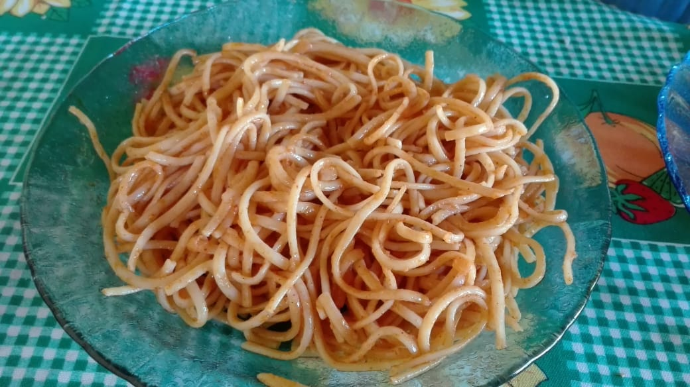

# Sopa Seca (Dry soup)

My mother likes to prepare Sopa Seca on Sundays as a side-dish for asado (barbecue). When I grow-up I learn this is not an Argentinian tradition, just something my mother, and the rest of my family like.

## Ingredients:

* 4 large garlic cloves
* 1 medium onion
* 2 bay leaves
* 3 tablespoons of sweet paprika
* 200 grams of spaghetti
* 1 tablespoon of salt
* black pepper to taste (typically, Argentinian food is not spicy)
* 1 liter of boiling water
* 4 tablespoons of oil (sunflower or olive)

## Instructions:

Chop the garlic and onion into very small pieces. Add cooking oil to a saucepan and bring to low heat, add the chopped garlic, chopped onion, bay leaves, salt and pepper and bring to low heat. Let it cook gently until the onion becomes transparent. Add the spaghetti and the boiling water, just the necessary to barely cover the noodles. Add the paprika. Stir gently and continue cooking at low heat for 10 to 12 minutes, keep adding water, just enough to cover the noodles. Turn off the flame and let rest for a few minutes before serving.

